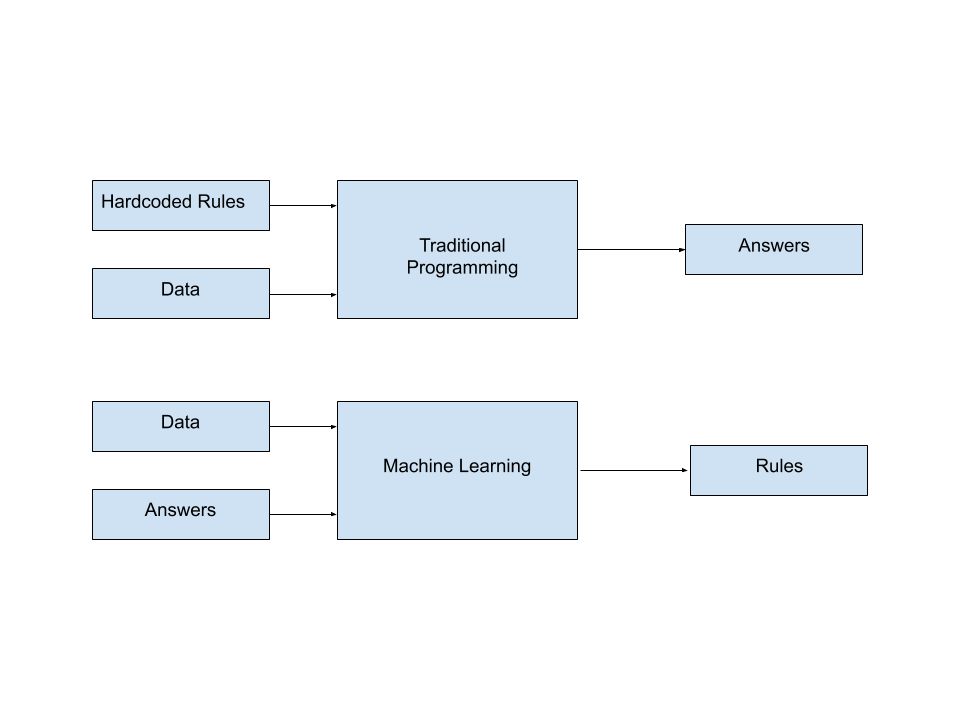

# Machine Learning

## Introduction

Machine Learning is widely known as the sub-branch of artificial intelligence which builds a mathematical representation of a system based only on data of various states of that system and without being explicitly programmed. The mathematical representation is known as the statistical model. A statistical model, in a broader sense, is basically a pattern that is found in the data. This is the knowledge that we gain from the information that was available. And it is this knowledge which helps us in taking wise decisions to achieve desired results. 

Definition by Microsoft - Machine Learning is a data science technique used to extract patterns from data, allowing computers to identify related data, forecast future outcomes, behaviors and trends.

Machine figures out the rules by itself based on the historical or the observed data. Machine learning is best suited for pattern recognition, anomaly detection, time series forecasting, recommendation systems etc in which the rules are not clear and or in some cases not at all known. 
Also during recent times, there has been a significant increase in the amount of data which is generated and stored. There has also been a lot of increase in the computational power. With the help of these two components, it is now possible for machine learning systems to find complex patterns and therefore devise complex statistical models. With legacy systems and approaches, it would require a lot of skilled human resources as well as time. Now with the existing statistical knowledge, it is possible for us to ask the machine learning system to build the required algorithms by themselves. Since machine learning systems use a subset of known data, it is capable of reproducing known knowledge. It is important to note that machine learning systems like any statistical model uses optimization to produce better results, but it optimizes on the unseen data rather than unseen data. Thus the learning system has to build a model of the given space which should be capable of prediction on the unseen state of that space. 

## Applications
Machine learning is not limited to any specific field, though it is widely used in healthcare, finance, manufacturing, retail, government and education. There is enormous potential to apply machine learning to solve problems in more efficient and impactful ways.
Following are the major areas where machine learning is wide used:  
1. Natural language processing - conversion of text-to-speech and speech-to-text, translation, topic detection, summarization etc.  
2. Computer vision - self-driving cars, object detection, object identification etc.  
3. Analytics - regression, classification, forecasting etc.  
4. Decision making - sequential decision making problems, recommendation systems etc.  

